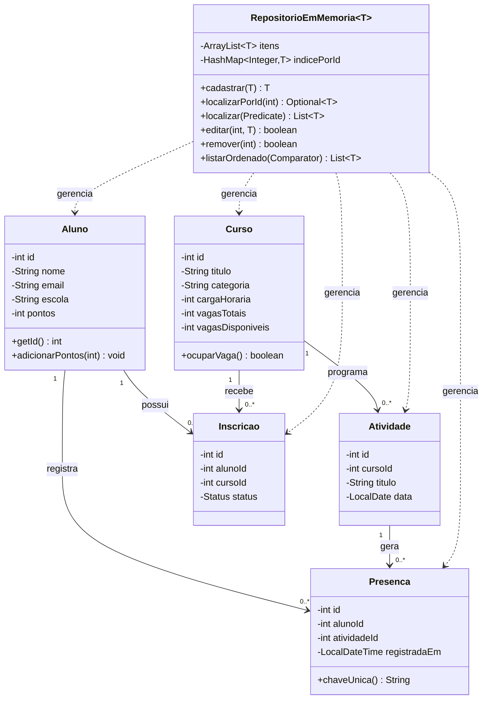

# Diagrama de Classes — Próxima Etapa (Entrega 1)

Contempla o mínimo exigido: `Aluno`, `Curso`, `Atividade`, `Inscrição`,
`Presença`. As demais classes (Certificado, Card, TestePerfil, Pergunta,
Alternativa, ResultadoPerfil, Mensagem, Notificação) entram na Entrega 2,
conforme o cronograma do projeto — já estão modeladas como tabelas no
banco (ver `backend/db/schema.sql`) e serão promovidas a classes Java no
próximo incremento.

## Como visualizar

- No GitHub: este arquivo já renderiza o diagrama automaticamente ao abrir
  o `.md` no navegador.
- Fora do GitHub: cole o bloco `mermaid` em <https://mermaid.live> para ver
  a imagem.
